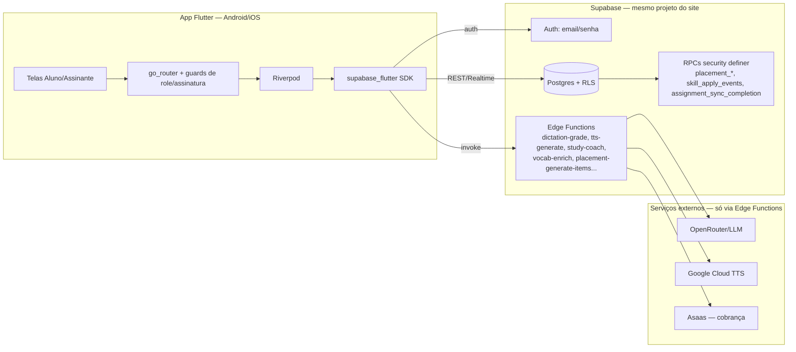

# Planejamento — App Mobile (Flutter)

## Contexto

A plataforma (ConnectLang) já roda como web app (React + Vite + Supabase) com quatro papéis: **Admin**, **Professor**, **Aluno** (matriculado numa escola, gerenciado por professor) e **Assinante** (self-service, paga assinatura via Asaas).

Este documento cobre o planejamento do **app mobile em Flutter**, com escopo definido:

- **Perfis no mobile**: só **Aluno** e **Assinante** (quem efetivamente estuda no dia a dia). Professor e Admin continuam só no site.
- **Paridade total, sem MVP reduzido**: dentro desses dois perfis, o app entrega **exatamente as mesmas funcionalidades do web** — ditado, vocabulário/SRS, biblioteca, caderno, nivelamento (placement), Study Coach (assinante), e atividades/leitura/produção/feedback/aulas dadas (aluno de escola). Nada fica de fora por fases; a única coisa que não entra na v1 é a **compra** da assinatura dentro do app (ver seção 1) — quem já assina usa 100% do app normalmente.
- **Plataformas**: Android e iOS.
- **Backend**: reaproveitar 100% o Supabase existente — mesmo projeto, mesmas tabelas, RLS, RPCs e edge functions. O app mobile é um cliente novo, não um backend novo.
- Quem constrói é você mesmo, então este plano é técnico (arquitetura, pacotes, estrutura), não só estratégico.

> Para o estado atual da implementação (o que já foi feito, ambiente configurado, próximo passo), ver [PROGRESSO.md](PROGRESSO.md).

---

## 1. Decisão confirmada: compra da assinatura continua só pelo site

Hoje o fluxo de assinatura (`/assinar`, `SubscriptionCheckoutForm.tsx`) captura cartão diretamente e cobra via Asaas (gateway brasileiro). Isso **não pode ser replicado do mesmo jeito dentro de um app nativo**: Apple (App Store Guideline 3.1.1) e, em menor grau, Google Play exigem que assinaturas de conteúdo digital consumido dentro do app passem pelo In-App Purchase deles (Apple Pay/Google Play Billing), com a Apple ficando com ~15-30% da receita. Um formulário de cartão próprio pra desbloquear estudo dentro do app tende a ser rejeitado na revisão.

**Decisão**: o app mobile não vende nada — é a única diferença real em relação ao web. Quem já assina pelo site loga e usa **100% das funcionalidades** normalmente (ditado, vocabulário, biblioteca, nivelamento, Study Coach, tudo). Quem ainda não assina vê uma tela explicando que precisa assinar pelo site, sem link de checkout clicável (pra não esbarrar na regra de "external purchase link" da Apple).

Se no futuro fizer sentido vender direto no app, a opção é IAP nativo (`in_app_purchase`, recibo validado em edge function nova, sincronizado com a tabela `subscriptions`) — mas isso dobra a complexidade de billing (duas fontes de verdade, reembolso, taxa de loja) e fica fora do escopo deste plano.

---

## 2. Arquitetura técnica

### 2.1 Visão geral



Ponto chave: no site, o client (`VITE_SUPABASE_URL` + chave publishable) **nunca** fala direto com OpenRouter/Google TTS/Asaas — só com Supabase, que por sua vez chama esses serviços dentro das edge functions. O app Flutter replica exatamente essa mesma borda de confiança: ele só precisa da URL do projeto Supabase e da chave `anon`/publishable, iguais às do `.env` do site. Nenhum segredo novo a proteger no app.

### 2.2 Stack recomendada

| Camada | Pacote | Por quê |
| --- | --- | --- |
| Backend client | `supabase_flutter` | SDK oficial — auth, Postgrest, Realtime, Storage, `functions.invoke()` para as edge functions. |
| Roteamento | `go_router` | Guards declarativos (equivalente a `RequireRole`/`RequireActiveSubscription` do `App.tsx`), deep links, redirecionamento por papel. |
| Estado | `flutter_riverpod` | Providers assíncronos mapeiam bem em cima do Supabase (streams/futures), fácil de testar, evita boilerplate de BLoC pra esse tamanho de app. |
| Modelos | `freezed` + `json_serializable` | Tipagem forte pros payloads (dictation attempt, vocab item, plano do coach) — mesmo espírito dos `types.ts` do web. |
| Áudio (TTS) | `just_audio` | Só **playback** — dictation não grava a voz do aluno, ele digita o que ouve (confirmado em `DictationPage.tsx`, que usa `new Audio()` pra tocar o áudio gerado pela edge function `tts-generate`). Nada de gravação de mic na v1. |
| Sessão segura | `flutter_secure_storage` (via config do `supabase_flutter`) | Persistência de sessão/token no keychain/keystore. |
| Formulários | `flutter_hook_form` ou `reactive_forms` | Equivalente ao `react-hook-form` + `zod` do web (validação de nivelamento, produção de texto etc.). |
| i18n | `flutter_localizations` + `intl`, ou `easy_localization` | Espelha o `ui_language` do `profiles` (idioma da interface) — hoje já são vários idiomas de interface no `src/i18n/resources.ts`. |
| Markdown | `flutter_markdown` | Textos da biblioteca usam editor markdown (`remark-gfm`/`remark-breaks` no web). |
| Erros/observabilidade | `sentry_flutter` (opcional já na v1) | App mobile falha "fora da vista" — vale ter desde cedo. |
| Push (fase 2) | `firebase_messaging` + `flutter_local_notifications` | Lembrete de revisão SRS vencida, ofensiva/streak (item já cogitado no `todo.md`). |
| IAP (fase 2, se decidir opção B da seção 1) | `in_app_purchase` | — |

### 2.3 Estrutura de pastas (feature-first, espelhando as rotas)

```
lib/
  app/
    router.dart              // go_router + guards (role, assinatura ativa)
    theme.dart
  core/
    supabase_client.dart      // init supabase_flutter, mesmas envs do site
    session/                  // AuthController (equivalente a AuthContext.tsx)
    i18n/
  features/
    auth/                    // login, recuperar senha, confirmar email, deep links
    onboarding/              // (se opção A: tela "assine pelo site")
    dictation/               // /aluno/ditado | /estudo/ditado
    vocabulary/              // /aluno/vocabulario | /estudo/vocabulario (+ SRS flashcards)
    library/                 // /aluno/biblioteca | /estudo/biblioteca (leitura de textos)
    notebook/                // /aluno/caderno | /estudo/caderno
    placement/               // /aluno/nivelamento/:lang | /estudo/nivelamento/:lang
    study_coach/             // /estudo/assistente (só assinante)
    production_demand/       // /estudo/producao-demanda/:id (só assinante)
    student_activities/      // /aluno/atividades, /aluno/leitura/:id, /aluno/producao/:id (só aluno)
    student_lessons/         // /aluno/aulas (aulas dadas — slides do professor)
    student_feedback/        // /aluno/feedback (correções do professor)
  shared/
    widgets/
    models/
```

Isso espelha `src/lib/learnerRoutes.ts`: no web, aluno e assinante já compartilham quase todas as telas via um conceito de "learner" com prefixo `/aluno` ou `/estudo`. Vale portar essa mesma abstração pro Flutter — uma feature "learner" parametrizada por role, em vez de duplicar tela por perfil.

### 2.4 Autenticação e deep links

- `supabase_flutter` cuida de login/sessão/refresh token.
- **Confirmar e-mail** e **redefinir senha** hoje são links de e-mail que abrem o site (`/confirmar-email`, `/redefinir-senha`). Pro app, configurar Universal Links (iOS) / App Links (Android) com um esquema tipo `connectlang://reset-password`, e adicionar essa URL nas Redirect URLs do projeto Supabase (`Auth > URL Configuration`). Dá pra manter o fluxo web funcionando em paralelo (não é ou-ou).
- Sessão: `RequireRole`/`RequireActiveSubscription` do `App.tsx` viram guards no `go_router` que leem `role` e status de `subscriptions` do `profiles`/perfil carregado no `AuthController`.

---

## 3. Mapeamento de funcionalidades → backend (o que já existe e será reaproveitado)

| Funcionalidade | Tabelas/RPCs | Edge Function | Observação |
| --- | --- | --- | --- |
| Login/perfil | `profiles`, `auth.users` | — | Trigger já cria `profiles` no signup. |
| Ditado (dictation) | `dictation_items`, `dictation_attempts` | `dictation-grade`, `dictation-diagnose`, `dictation-next`, `dictation-reinforce`, `tts-generate` | App só toca o áudio (`just_audio`) e manda a resposta digitada pra função de correção. |
| Vocabulário/SRS | `student_vocabulary`, `student_vocabulary_categories` | `vocab-enrich`, `vocab-explain` | Fila de revisão calculada client-side (mesma lógica de `interval_minutes`/`srs_difficulty` do web) ou movida pra uma view/RPC — decidir na hora. |
| Biblioteca de textos | `texts_library`, `student_text_reads` | `text-questions-generate`, `tts-generate` | Leitura + marcar como lido + perguntas de compreensão. |
| Caderno (notebook) | `student_notebook_entries` | — | CRUD simples. |
| Nivelamento (placement) | `placement_sessions`, `placement_answers` (via RPC) | `placement-generate-items`, `placement-grade-production` | **Não inserir direto** — sempre via `placement_start_test`/`placement_submit_answer`/`placement_submit_production` (security definer). |
| Study Coach (só assinante) | `subscriber_daily_study_plans`, `subscriber_study_assignments` | `study-coach`, `study-insights-rollup` | Plano gerado sob demanda pela function — app só chama e renderiza. |
| Produção sob demanda (só assinante) | `subscriber_study_assignments` (kind produção) | `dictation-grade`/correção de texto | Mesma tela conceitual do Study Coach, item avulso. |
| Atividades/leitura/produção (só aluno) | `activities` | — | Atividade criada pelo professor: leitura (`ReadingPage`) ou produção de texto (`ProductionPage`), vinculada a turma/aluno. |
| Correções/feedback (só aluno) | `submissions` (+ `submission_versions`) | — | Envio do aluno + comentário/nota do professor. |
| Aulas dadas (só aluno) | `lesson_plans` (`target_student_id`) | — | Slide/material que o professor subiu depois da aula. |
| Progresso de skills | `user_skill_progress`, `user_skill_events` | RPC `skill_apply_events` | Somente leitura direto da tabela; mutação sempre via RPC. |
| Assinatura (status) | `subscriptions` | — | App só **lê** status (`active`/`trialing`/`overdue`/...); não cria/edita (ver seção 1). |

Nenhuma lógica de negócio nova precisa ser escrita no backend para o MVP mobile — é essencialmente o mesmo contrato de dados que o web já usa.

---

## 4. Escopo da v1 (completo, sem corte de funcionalidade)

Tudo abaixo entra na primeira versão publicável — a única coisa fora é a compra de assinatura dentro do app (seção 1). Ordem sugerida de construção (não de "o que fica de fora", só a sequência mais eficiente pra codar, de mais isolado pra mais dependente):

1. **Base**: login, recuperação de senha, deep links, `AuthController`, shell de navegação por role.
2. **Vocabulário + flashcards SRS** — feature mais isolada, valida todo o pipeline auth → RLS → UI.
3. **Caderno** — CRUD simples, mesmo padrão.
4. **Biblioteca de textos** — leitura, marcar como lido, salvar vocabulário do texto, perguntas de compreensão.
5. **Ditado** — depende de `tts-generate` e das functions de correção/diagnóstico.
6. **Nivelamento (placement)** — fluxo de várias etapas via RPC, vale isolar bem antes de mexer.
7. **Aluno de escola**: atividades (`activities`), leitura/produção vinculadas, correções/feedback (`submissions`), aulas dadas (`lesson_plans`).
8. **Assinante**: Study Coach (plano diário via IA) e produção sob demanda (`subscriber_study_assignments`).
9. **Tela de "assinatura inativa"** pra assinante sem plano ativo (redireciona pro site, sem checkout no app).

### Fase 2 — pós-lançamento (não existe no web hoje, é ganho novo do mobile)
- Notificações push (revisão SRS vencida, lembrete de estudo, ofensiva/streak).
- IAP nativo (seção 1, opção B), se decidir vender assinatura direto no app.
- Modo offline básico (cache de vocabulário/textos já vistos).
- Widgets de home screen (streak, palavra do dia).

---

## 5. Decisões em aberto (responder antes de começar a codar)

| Tema | Pergunta | Impacto |
| --- | --- | --- |
| Onboarding sem conta | Alguém abre o app sem ter assinatura — o que ele vê? Só tela de login, ou uma landing simplificada explicando o produto? | Design da tela inicial. |
| SRS client-side vs. servidor | Manter o cálculo da fila de revisão no client (como hoje, implícito no front) ou mover pra uma RPC/view no Postgres, compartilhável entre web e mobile? | Evita duplicar a regra de negócio em Dart e TS. |
| Design system | Portar visualmente o shadcn/ui atual (cores, tipografia) ou criar um look mobile-first novo? | Tempo de UI. |
| Contas de desenvolvedor | Já tem Apple Developer Program (US$99/ano) e Google Play Console (US$25 único)? | Bloqueia publicação nas lojas, não o desenvolvimento. |

---

## 6. Resumo em uma frase

> **App Flutter com paridade total ao web para Aluno e Assinante — ditado, vocabulário/SRS, biblioteca, caderno, nivelamento, Study Coach, atividades/correções/aulas do aluno de escola — reaproveitando 100% o Supabase existente (mesmas tabelas, RLS e edge functions). A única diferença é a compra: fica só pelo site na v1; push notification, offline e IAP nativo ficam como evolução pós-lançamento.**
